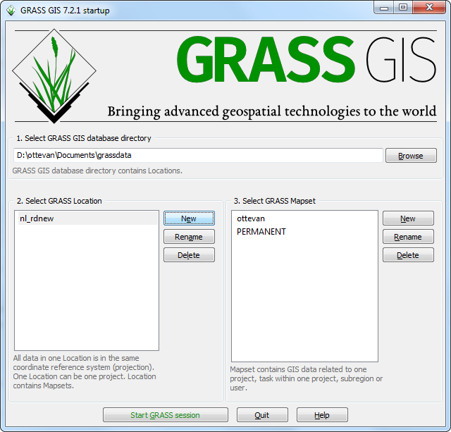
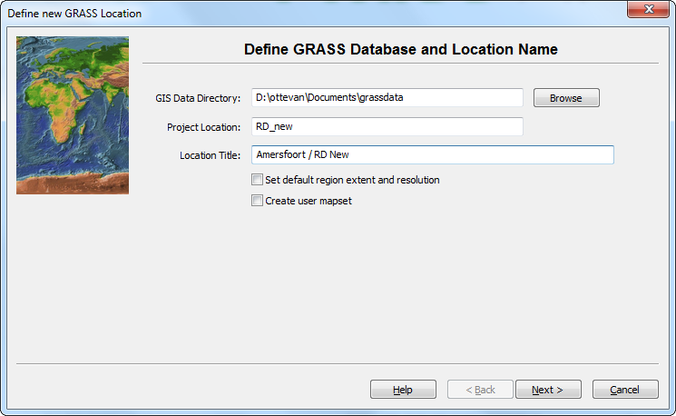
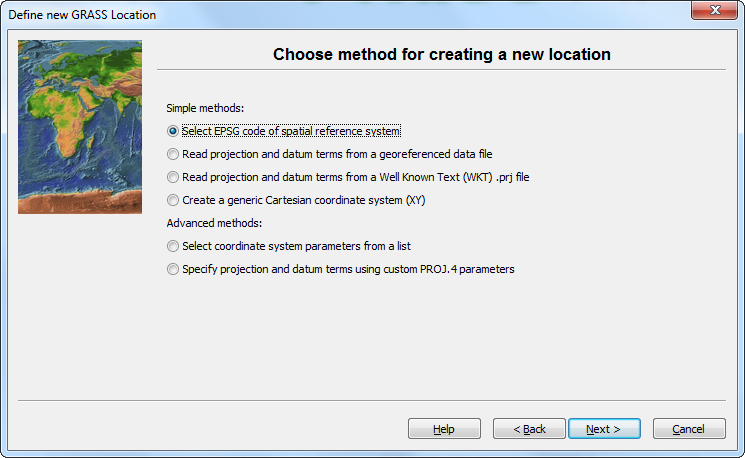
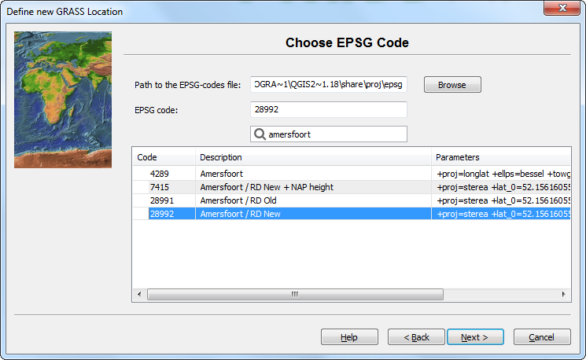
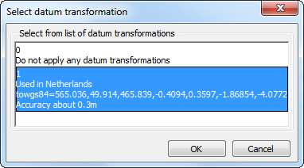
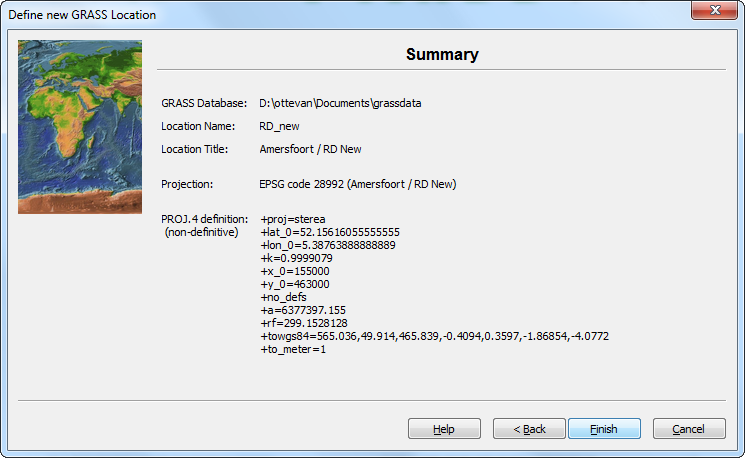
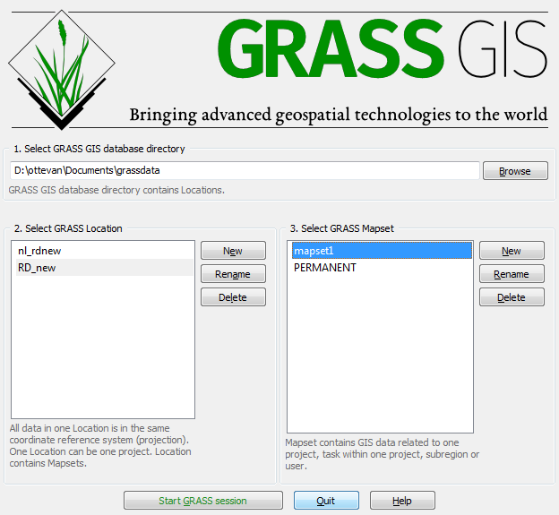

# GRASS Python scripting
_Hands on lunch  (30-4-2018, Deltares, Delft) by Willem Ottevanger and Marc Weeber_

## 1. Preliminary steps
### 1.1 Install GRASS
GRASS is deliverd with [QGIS](https://www.qgis.org/en/site/forusers/download.html).
This is the easiest option to get started. Choose the `QGIS Standalone Installer Version 2.18 (64 bit)`.

### 1.2 Setup GRASS mapset location

Before starting we need to setup the GRASS projection and mapset.
In the *scripts* folder you will find the following command:

``` > setup_grass_location.bat ```

This will bring up the following window. Click 'New' to create a new GRASS location


Fill in Project Location as: **RD_new** and the GRASS Mapset to **Amersfoort / RD New**


Select a method to choose the EPSG code:


We will use Amersfoort / RD new


including the datum transformation


A summary is provided of the newly defined location


A new mapset can be created by using the 'New' button. Call this mapset 'mapset1'


After this you can press 'Quit'.

## 1.3 Running python packaged with QGIS
* Load a command window with the necessary paths loaded for GRASS
``` > cmd_grass.bat ```

* Run the following command within the command window to check your setup
``` > %GRASS_PYTHON% setup_grass_environment.py ```

After running you should see the following output:
```
Current GRASS GIS 7 environment:
{u'MAPSET': u'mapset1', u'GISDBASE': u'D:\\user\\Documents/grassdata', u'LOCATION_NAME': u'RD_new'}
Available raster maps:
Available vector maps:
```

## 1.4 Interactive python enviroment
Instead of using the python environment, it is also possible to connect to the grass
python libraries from a locally setup python environment using [Anaconda](https://www.anaconda.com/download/). This has advantages of interactive code development, as well as interfacing with other python libraries which can be installed using conda (or otherwise pip).

* Start an Anaconda prompt (from Start menu)
* Install a clean anaconda environment with jupyter

``` > conda create -n gispy python=2 jupyter ```

* Activate the conda enviroment

``` > activate gispy ```

* In a later phase you can run start the environment using from the scripts folder

``` > start_conda_cmd.cmd ```

* Nexy set all relevant paths

``` > set_conda_grass_env.bat ```

* In the exercises folder run

``` > jupyter notebook ex1.ipynb ```


## 2. GRASS basics

GRASS commands are preceded by the following prefixes depending on the functionality:

| prefix   | section     | description                  |
|----------|-------------|------------------------------|
| `g.`     | `general`   | generic commands             |
| `v.`     | `vector`    | 2D/3D vector data processing |
| `r.`     | `raster`    | 2D raster data processing    |
| `db.`    | `database`  | attribute data management    |
| `d.`     | `display`   | display commands             |
| `i.`     | `imagery`   | imagery data processing      |
| `ps.`    | `postscript`| map outputs                  |
| `r3.`    | `raster3D`  | 3D raster data processing    |


## Further reading
1. https://github.com/GISMentors/grass-gis-workshop-jena-2018
2. https://grass.osgeo.org/grass74/manuals/
3. https://github.com/wenzeslaus/python-grass-addon
4. https://grasswiki.osgeo.org/wiki/GRASS_and_Python#External_Python_editors_.28IDE.29
